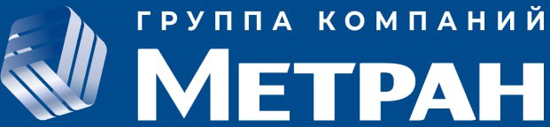

# Система отслеживания производственных процессов с помощью RFID-меток

<div align="center">
  
</div>

## 📋 Описание проекта

Проект разработан для АО «МЕТРАН» и представляет собой комплексную систему учета и отслеживания этапов производственного процесса датчиков с использованием RFID-меток. Система позволяет отслеживать перемещение датчиков между различными этапами производства, контролировать качество и учитывать брак.

## 🔑 Основные возможности

- **Маркировка датчиков**: Регистрация новых датчиков в системе с присвоением уникальных серийных номеров
- **Отслеживание этапов производства**: Контроль и запись прохождения датчиками всех этапов производства (маркировка, сборка, тестирование, упаковка)
- **Учет брака**: Возможность регистрации бракованных изделий с указанием причины
- **Администрирование**: Расширенная админ-панель для управления пользователями, датчиками и получения статистики
- **Управление сессиями**: Система учета рабочих сессий сотрудников
- **Отчеты**: Формирование отчетов о производственных процессах

## 🏗️ Архитектура системы

Проект разделен на несколько ключевых компонентов:

- **GUI**: Пользовательский интерфейс на основе PySide6 (Qt)
- **DataBase**: Серверная часть и логика работы с базой данных PostgreSQL
- **Android**: Мобильное приложение для взаимодействия с RFID-метками
- **3D design**: 3D-модели компонентов для интеграции RFID-считывателей

## 💻 Технический стек

- **Backend**: Python, asyncpg, asyncio
- **Frontend**: PySide6 (Qt)
- **БД**: PostgreSQL
- **Мобильное приложение**: Android
- **Дизайн**: 3D-моделирование

## 🚀 Запуск проекта

### Требования

```
numpy==2.2.3
pyserial==3.5
PySide6==6.8.2.1
PySide6_Addons==6.8.2.1
PySide6_Essentials==6.8.2.1
shiboken6==6.8.2.1

```

### Установка и запуск

1. Клонируйте репозиторий
2. Установите зависимости: `pip install -r GUI/requirements.txt`
3. Запустите пользовательский интерфейс из директории GUI

## 📊 Структура базы данных

Система использует PostgreSQL для хранения информации о:
- Датчиках и их статусе
- Пользователях системы
- Рабочих сессиях
- Отчетах о производстве
- Секторах хранения упакованных изделий

## 👥 Команда разработчиков "404 Not Found"

Мы — команда молодых инженеров и разработчиков, специализирующихся на создании высокотехнологичных решений для современных производств. Наш проект сосредоточен на разработке устройства с использованием технологии RFID-меток для упрощённой маркировки и отслеживания продукции на производственных линиях.

### Состав команды:
- **Кирилл Табаков** (14 лет) — инженер ПТО 🔧
- **Дмитрий Гилязов** (14 лет) — Back-end разработчик/архитектор баз данных/сетевой инженер 💻
- **Степан Замолдинов** (17 лет) — инженер-конструктор 🏭
- **Дмитрий Беспалов** (13 лет) — Front-end разработчик/UI UX разработчик 👩‍💻
- **Макар Ардашев** (17 лет) — продакт-менеджер 🧾
- **Дмитрий Шефер** (14 лет) — паяльщик 🔨

### Наши цели:
- Разработка и утверждение устройства с использованием RFID-технологий
- Создание серверной части и разработка API для взаимодействия с системой
- Проектирование и тестирование приложений для рабочих мест и менеджмента
- Интеграция системы в производственные процессы и обучение сотрудников

### Преимущества нашей системы:
- ✅ **Снижение ошибок**: Минимизация человеческого фактора и автоматическое считывание меток
- 🏃‍♂️ **Ускорение процессов**: Быстрое и точное отслеживание продукции
- 💃 **Эффективное управление**: Централизованный контроль и мониторинг в реальном времени
- 💃 **Удобство использования**: Интерактивные интерфейсы для операторов и менеджеров

Мы уверены, что современные технологии могут существенно изменить производственные процессы и помочь компаниям выйти на новый уровень эффективности.

## 📄 Лицензия

Все права защищены © 2025 АО «МЕТРАН»
